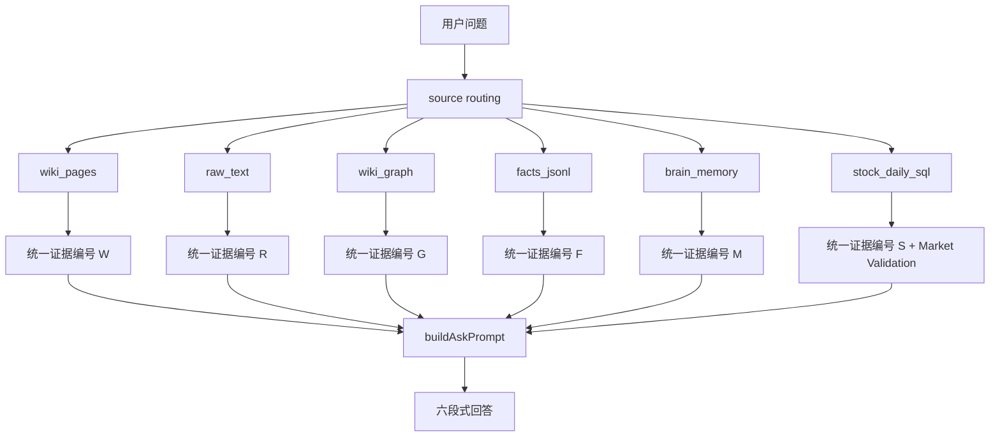

# Trading Review Wiki Codex CLI

> 面向交易复盘知识库的 Codex CLI 工具集：把 raw 资料、正式 wiki、图谱、长期记忆、结构化事实和行情 SQL 组织成一个可检索、可验证、可迭代的交易研究系统。

这个仓库现在的主定位不是单纯桌面应用，而是围绕 live 知识库运行的一套自动化 CLI：

- 多源 RAG 问答：`wiki / raw / graph / facts / brain / stock_daily_sql`
- App-grade 知识摄入：`api-run -> finalize -> apply --write`
- 盘前预测与盘后验证：`daily-loop`
- 公司深度研究底稿：`company-research --deep`
- 长期纠错与自训练：`brain / market-validate / self-train`
- Wiki 维护和检索质量治理：`hygiene / ask eval / vector maintenance`
- Gangtise/OpenClaw 主题资料导出与摄入辅助

## Desktop App Builds

If you want the earlier Tauri desktop app instead of the Codex CLI toolchain, use the historical desktop builds from [GitHub Releases](https://github.com/ymj8903668-droid/trading-review-wiki/releases). The desktop app keeps the familiar three-pane wiki UI, quick review workflow, settlement import, graph view, settings panel, and Save to Wiki flow.

The current `main` branch is optimized for CLI automation and agent-assisted wiki maintenance. Desktop users can keep using the published release artifacts while CLI users work from source.

## v0.10.5 更新重点

本次公开更新把 CLI 从“能摄入、能检索”推进到“能追踪事实状态”的轻量 Graphiti-style 时序事实层：

- **Temporal Facts v1**：新增 `data/facts/temporal_edges.jsonl` 账本和 `factWrites` manifest 区域，把会过期、会被证伪、会被后续来源替代的事实从普通 wiki 页面中拆出来。
- **当前事实视图**：`ask` 默认只把 active/current facts 作为普通 `[F]` 证据；`superseded / invalidated / expired` 只作为历史和反证线索，避免旧事实污染答案。
- **审计开关**：`ask` 和 `ask eval` 支持 `--include-invalidated`，用于追查历史矛盾、替代链和证伪记录。
- **Predicate / Alias 候选审计**：新增 `temporal-facts audit`，从现有 `wiki/**/*.md` 提取 predicate、概念别名、tag 和缩写候选，输出给人工复核。
- **摄入边界更稳**：`ingest/apply` 仍不写 `raw/**`；`factWrites` 只能写 `data/facts/temporal_edges.jsonl`；计划规模保护改为 `plan-budget.json` 软告警，不再阻断正常多页面摄入。

详细设计见 [`docs/temporal-facts-v1.md`](docs/temporal-facts-v1.md)，完整更新说明见 [`CHANGELOG.md`](CHANGELOG.md)。

## Usage And Integration

- [CLI 外部接入与使用指南](docs/CLI外部接入与使用指南.md)：给 OpenClaw、龙虾、Shell/Python/Node 调度器和其它非 Codex 软件看的完整接入说明，包含从 0 新建 wiki 化知识库和接入已有 wiki 化知识库两条路径。
- [交易复盘 Schema 参考模板](docs/交易复盘Schema参考模板.md)：从真实交易复盘 wiki 抽象出的 `schema.md` 示例，适合从 0 建库、改造已有 wiki 或给外部 Agent 定义写入边界。
- [多源检索 RAG 完整流程](docs/多源检索RAG完整流程.md)：解释 `ask` 如何融合 wiki/raw/graph/facts/brain/SQL。
- [Temporal Facts v1](docs/temporal-facts-v1.md)：解释时序事实账本、predicate、状态和人工审计流程。

## Directory Boundaries

| 路径 | 角色 | 写入规则 |
|---|---|---|
| 本仓库 | CLI/桌面源码仓库 | 开发和提交工具代码 |
| 本地 Trading Review Wiki 工作区 | live 知识库 | `raw/`、`wiki/`、`data/brain/`、`data/facts/` 数据在这里 |
| 本地 Codex skills 目录 | Codex skills 入口 | 自动化工作流的可复用包装 |
| 本地自动化目录 | 自动化环境 | 定时任务、DB config、局部 `CODEX_HOME` |

重要约束：

- `ask` 永远只读，不写 `wiki/`、`raw/`、`data/brain/`。
- `raw/` 原始资料不可变；CLI 不直接改写 raw 内容。
- `daily-loop` 写入范围只限 `data/brain/*.jsonl` 和 `.llm-wiki/daily-research/` 或 `.llm-wiki/wiki-feedback/`。
- `company-research` 只写 `.llm-wiki/company-research/` 底稿、模型和候选页，不直接写正式 `wiki/`。
- `apply --write` 是正式 wiki 写入入口；没有 `--write` 一律 dry-run。

## 快速开始

```sh
cd /path/to/trading-review-wiki
npm install
npm test -- --run
```

示例 project 路径：

```sh
/path/to/your/trading-review-wiki-project
```

默认使用本地 Codex 登录态：

```sh
--provider codex
```

## 常用命令

### 多源问答

```sh
npm run codex:ingest -- ask \
  --query "最近一周机器人产业链有哪些变化？区分订单兑现和情绪催化" \
  --project /path/to/your/trading-review-wiki-project \
  --provider codex \
  --show-context \
  --show-sources
```

常用 source：

| `--sources` | 用途 |
|---|---|
| `auto` | 规则 + LLM 自动路由 |
| `wiki,raw,graph` | 正式页、原始资料、有界图谱扩展 |
| `wiki,raw,graph,brain` | 增加长期纠错/验证记忆 |
| `facts` | 只查结构化事实 JSONL |
| `brain` | 只查长期记忆 |
| `stock-price` | 只查本地股票日线 SQL |
| `wiki,raw,graph,stock-price` | 叙事证据 + 市场量价验证 |

调试源路由：

```sh
npm run codex:ingest -- ask \
  --query "绿的谐波最近20个交易日量价如何" \
  --sources wiki,raw,graph,stock-price \
  --show-sources
```

带历史/反证事实审计：

```sh
npm run codex:ingest -- ask \
  --query "机器人产业链里哪些订单或验证信号后来被反驳过？" \
  --project /path/to/your/trading-review-wiki-project \
  --provider codex \
  --sources wiki,raw,graph,facts \
  --include-invalidated \
  --show-context \
  --show-sources
```

### Temporal Facts v1

时序事实层只记录“需要时间感知和可证伪状态”的事实边，不替代正式 wiki 页面：

| 能力 | 命令/文件 |
|---|---|
| 事实写入 | `apply --write` 读取 manifest 的 `factWrites` |
| 事实账本 | `data/facts/temporal_edges.jsonl` |
| 重复保护 | deterministic fact id，重复执行不会重复追加 |
| 替代/证伪 | `supersedes / contradictedBy / status` |
| 默认检索 | active/current facts 进入普通 `[F]` 证据 |
| 审计检索 | `--include-invalidated` 查看历史、替代和反证 |
| 候选提取 | `temporal-facts audit` |

审计现有 wiki 的 predicate / alias / tag / abbreviation 候选：

```sh
npm run codex:ingest -- temporal-facts audit \
  --project /path/to/your/trading-review-wiki-project \
  --limit 200
```

输出位于：

```text
.llm-wiki/temporal-facts/
```

这些候选只是人工复核清单，不会自动改写正式 wiki。

### App-grade 摄入

```sh
npm run codex:ingest -- prepare \
  --source /path/to/source.md \
  --project /path/to/your/trading-review-wiki-project

npm run codex:ingest -- api-run \
  --source /path/to/source.md \
  --project /path/to/your/trading-review-wiki-project \
  --provider codex \
  --model gpt-5.5

npm run codex:ingest -- finalize \
  --report /path/to/.llm-wiki/codex-ingest/<report-id> \
  --provider codex

npm run codex:ingest -- apply \
  --manifest /path/to/changes.json \
  --project /path/to/your/trading-review-wiki-project \
  --write
```

摄入链路的关键检查：

- `fatal == 0`
- `wroteRaw == false`
- `wroteRootLog == false`
- source hash 稳定
- `wiki-change-review.md` 可人工审阅
- `apply --write` 之前必须明确写入范围

### 盘前 / 盘后 daily-loop

盘前预测：

```sh
npm run codex:ingest -- daily-loop \
  --mode premarket \
  --project /path/to/your/trading-review-wiki-project \
  --provider codex \
  --model gpt-5.5 \
  --reasoning-effort xhigh \
  --lookback-days 30 \
  --max-stocks-per-question 8 \
  --validation-windows 1,3,5,10,20 \
  --write
```

盘后 pending validation：

```sh
npm run codex:ingest -- daily-loop \
  --mode postclose \
  --validate-pending-only \
  --project /path/to/your/trading-review-wiki-project \
  --write
```

包装脚本：

```sh
<codex-skills-dir>/trading-wiki-mpa-loop/scripts/daily-loop-premarket-research.sh
<codex-skills-dir>/trading-wiki-mpa-loop/scripts/daily-loop-postclose-pending.sh
```

语义：

- 预测从 `prediction.createdAt / answeredAt / date` 后的第一个交易日开始验证。
- 1/3/5/10/20 日窗口是 horizon tracks，不是互相覆盖。
- 周末和非交易日默认 skip，除非手动 `--force`。
- SQL 真值来源由本地只读配置指定。

### 公司深度研究

```sh
npm run codex:ingest -- company-research \
  --stock "绿的谐波" \
  --project /path/to/your/trading-review-wiki-project \
  --provider codex \
  --deep
```

输出位置：

```text
.llm-wiki/company-research/<report-id>/
```

典型产物：

- `deep-company-report.md`
- `financial-model-v2.xlsx`
- `business-breakdown.json`
- `evidence-ledger.json`
- `deep-quality-audit.json`
- `wiki-change-candidates.md`

### Brain memory

```sh
npm run codex:ingest -- brain remember \
  --type correction \
  --text "高开接盘必须看承接，不允许把热度当作买点" \
  --project /path/to/your/trading-review-wiki-project

npm run codex:ingest -- brain status \
  --project /path/to/your/trading-review-wiki-project

npm run codex:ingest -- brain resolve \
  --id <brain-id> \
  --result success \
  --project /path/to/your/trading-review-wiki-project
```

### 行情验证

```sh
npm run codex:ingest -- market-validate \
  --prediction "绿的谐波机器人链条继续走强" \
  --stock "688017" \
  --window 20d \
  --project /path/to/your/trading-review-wiki-project
```

### 检索质量评估

```sh
npm run codex:ingest -- ask eval \
  --query "物理AI 绿的谐波 谐波减速器 机器人" \
  --expect-paths "wiki/股票/绿的谐波.md,wiki/概念/物理AI与具身智能.md" \
  --project /path/to/your/trading-review-wiki-project
```

### Wiki hygiene

```sh
npm run codex:ingest -- hygiene audit \
  --project /path/to/your/trading-review-wiki-project

npm run codex:ingest -- hygiene plan \
  --project /path/to/your/trading-review-wiki-project

npm run codex:ingest -- hygiene apply \
  --project /path/to/your/trading-review-wiki-project \
  --write
```

## 多源 RAG 流程



核心机制：

1. `selectAskSources()` 先做 source routing。
2. `searchAskCandidates()` 对 `wiki/` 和 `raw/` 做结构化召回。
3. `frontmatter` 是一等召回字段，`title / aliases / tags / related / sources / summary / type` 都参与加权。
4. ask 模式读取 `updated / last_reviewed / created`，近期内容加分，陈旧的概念/股票/总结/源文档/查询页温和降权。
5. `raw` 在 ask 模式下按日期和质量限量扫描，避免噪声淹没正式 wiki。
6. wiki 页面里的 `sources` 会反向 boost 对应 raw，形成“正式页牵引原始证据”。
7. `expandAskGraph()` 从 top wiki hits 做有界图谱扩展：默认一跳；产业链/上下游/受益方向类问题自动二跳，也可手动 `--graph-depth 2`。
8. `facts_jsonl` 和 `brain_memory` 用 JSONL native token filter。
9. `stock_daily_sql` 用只读 PostgreSQL 查询日线，并生成 Market Validation。
10. `buildAskPrompt()` 把所有证据编号为 `W/R/G/F/M/S`，要求答案逐条引用。

固定回答章节：

```text
结论
证据链
分歧/反证
后续验证
交易含义
引用来源
```

## 股票 SQL 配置

股票 SQL 是可选只读源，只从本机环境变量、私有配置文件或系统钥匙串读取连接信息。公开文档不记录具体主机、端口、用户名、配置文件路径、钥匙串条目名称或密码值。

配置原则：

- 连接信息留在本机，不写入仓库。
- 密码不打印、不落盘、不进入命令行示例。
- 配置缺失时返回 evidence insufficiency，不编造行情。
- 共享仓库时只提交变量名和安全规则，不提交个人连接细节。

安全规则：

- 不打印密码。
- 不把密码写入文件。
- 不把密码提交到 git。
- SQL 不可用时报告 evidence insufficiency，不编造行情。

## 开发验证

```sh
npm test -- --run
npm run build
git diff --check
```

本分支关键测试覆盖：

- schema-aware ask/ingest retrieval
- structured wiki retrieval
- raw scan policy
- segmented ingest candidate retrieval
- ask source routing
- facts / brain / stock SQL native source
- graph expansion
- anchored daily-loop validation

## 当前版本重点

详见 [CHANGELOG.md](CHANGELOG.md)。完整 RAG 链路说明见 [docs/多源检索RAG完整流程.md](docs/多源检索RAG完整流程.md)。当前 Codex CLI 分支的重点是：

- 多源 RAG 完整化：`wiki/raw/graph/facts/brain/stock_daily_sql`
- 正式 wiki frontmatter 结构字段优先召回
- ask 读取 frontmatter 更新时间并对久未更新内容温和降权
- graph 默认一跳，产业链/受益方向类 query 可自动二跳，并输出 hop/pathTrace 诊断
- raw 鲜度、日期 hint 和噪声控制
- ingest 候选分段召回，降低长源多主题漏召回
- daily-loop 锚定第一个交易日后的多窗口验证
- 本地 SQL + Tencent 外部行情交叉验证
- 本地凭据加载股票 SQL 配置
- vector store 维护命令
- wiki housekeeping 日志与安全 raw search policy

## License

GNU General Public License v3.0. See [LICENSE](LICENSE).
