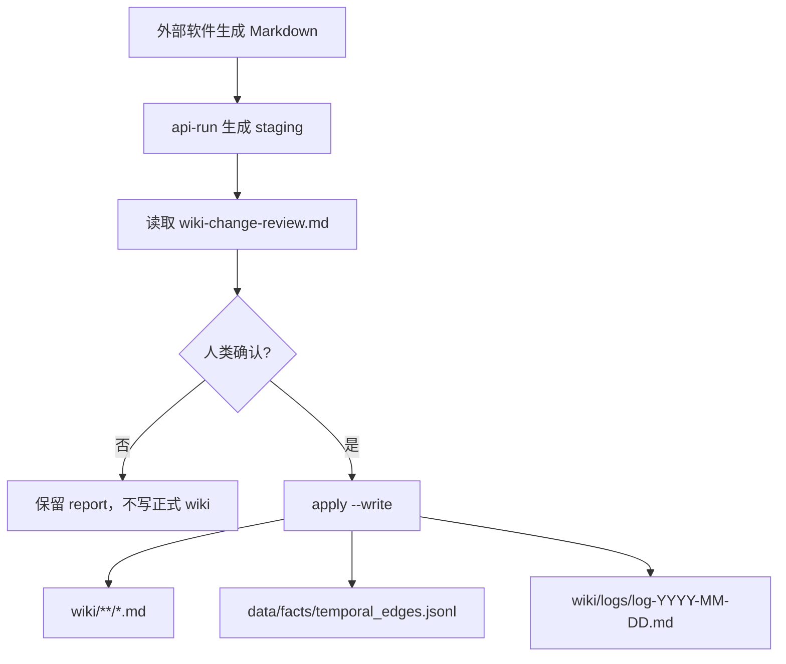
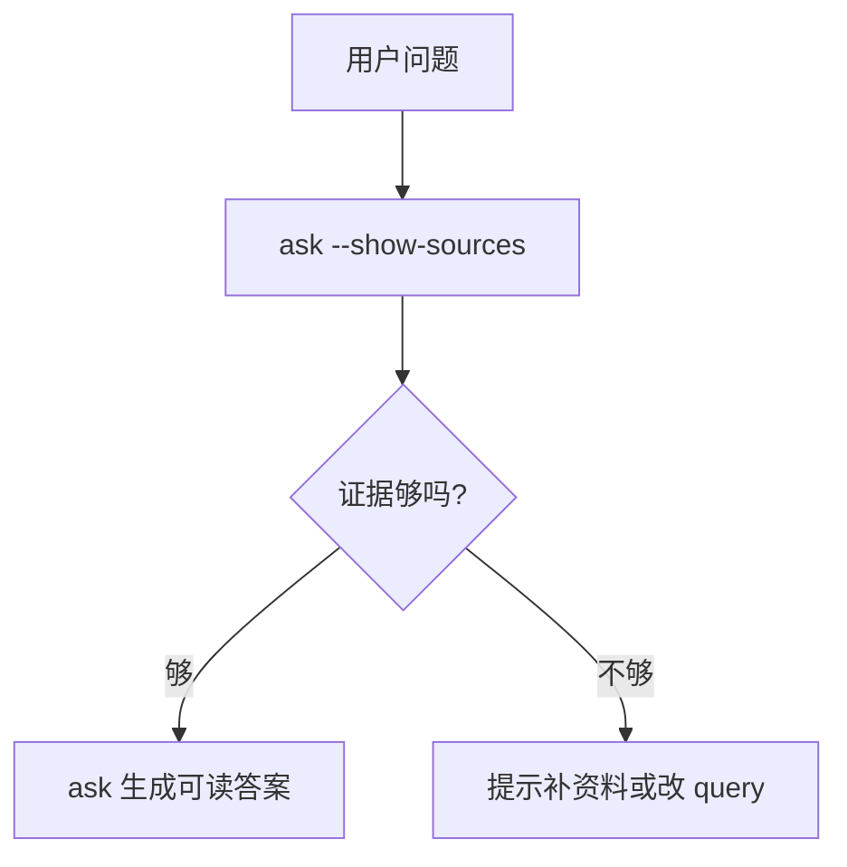
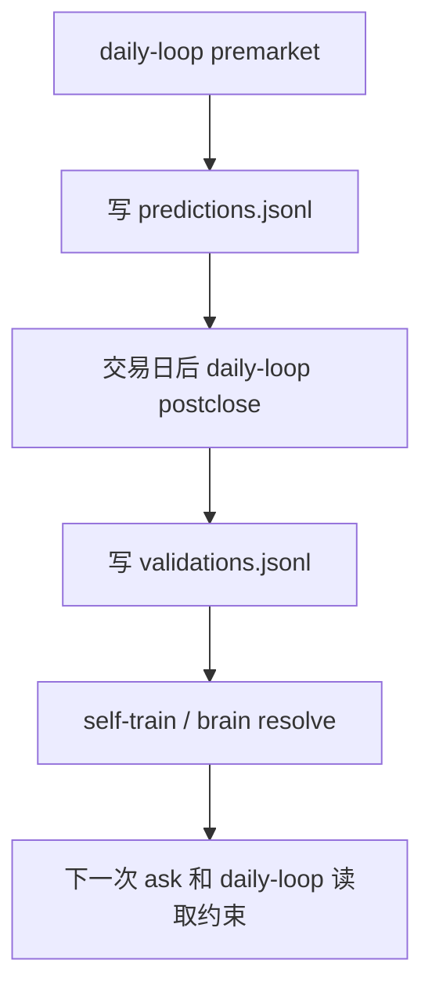

# Codex CLI 外部接入与使用指南

这份文档说明如何把 Trading Review Wiki Codex CLI 当作一个通用知识库引擎使用。它不要求调用方一定是 Codex；OpenClaw、龙虾、Shell 定时任务、Python 服务、Node 服务、桌面应用和其它 Agent 都可以通过子进程调用它。

## 1. 这套 CLI 是什么

它是围绕本地 Trading Review Wiki 工作区运行的一组命令行能力：

- 把 `raw/**` 原始资料变成可审阅、可回滚的 `wiki/**/*.md` 更新。
- 对 `wiki / raw / graph / facts / brain / stock_daily_sql` 做多源检索问答。
- 用 `data/facts/temporal_edges.jsonl` 记录会变化、会失效、会被证伪的时序事实。
- 用 `data/brain/*.jsonl` 记录纠错、预测、验证、偏好和 guardrail。
- 生成公司深度研究、盘前问题、盘后验证、训练样本和检索质量评估。

核心边界：

- `raw/**` 是原始资料，CLI 不改写。
- `ask` 永远只读。
- 正式写入 wiki 只通过 `apply --write`。
- 时序事实只写 `data/facts/temporal_edges.jsonl`。
- 股票 SQL 只从本机私有配置读取，公开仓库不保存连接信息或密码。

## 2. 两种上手路径

外部用户一般有两种情况：一种是还没有 wiki，需要从 0 建库；另一种是已经有一套 wiki 化知识库，需要让 CLI 接管摄入、检索、事实和自动化。两种路径都能用这套 CLI，但第一步不同。

### 2.1 从 0 开始做自己的 wiki 化知识库

适合对象：

- 现在只有零散 Markdown、PDF 摘要、会议纪要、复盘、聊天记录或研究资料。
- 还没有稳定的 `raw/` 和 `wiki/` 分层。
- 想让系统逐步把资料“编译”成可检索、可更新、可验证的知识网络。

最小项目结构：

```text
my-wiki-project/
├── purpose.md
├── schema.md
├── raw/
│   ├── inbox/
│   └── notes/
├── wiki/
│   ├── index.md
│   └── logs/
├── data/
│   ├── facts/
│   └── brain/
└── .llm-wiki/
```

每个目录的职责：

| 路径 | 用途 |
|---|---|
| `purpose.md` | 写清楚这个知识库为什么存在、服务什么问题、什么算好答案 |
| `schema.md` | 写页面类型、目录规则、frontmatter、命名和写入边界 |
| `raw/**` | 原始资料，只追加不改写 |
| `wiki/**` | LLM 维护的正式知识页 |
| `data/facts/**` | 结构化事实，特别是会变化的时序事实 |
| `data/brain/**` | 长期纠错、偏好、预测、验证和 guardrail |
| `.llm-wiki/**` | CLI 运行报告、审计报告、eval、临时 staging |

最小 `purpose.md` 可以先写 5 件事：

```md
# Purpose

- 这个知识库服务什么领域？
- 用户最常问的 5 类问题是什么？
- 哪些资料是最高可信来源？
- 哪些结论必须保留反证和时间状态？
- 什么情况下宁可回答“证据不足”也不能猜？
```

最小 `schema.md` 可以先写 6 条规则：

```md
# Schema

- raw/** 是原始资料，不改写。
- wiki/** 是正式知识页，使用 Markdown 和 [[wikilink]]。
- 每个正式页面包含 title/type/tags/created/updated/sources。
- index.md 是目录，overview.md 可作为全局概要。
- 会过期或会被证伪的事实写入 data/facts/temporal_edges.jsonl。
- ask 只读；正式写入必须经过 apply --write。
```

如果你做的是交易复盘类知识库，可以直接参考更完整的 [`交易复盘 Schema 参考模板`](交易复盘Schema参考模板.md)。它把真实交易复盘 wiki 的三层架构、页面类型、frontmatter、ingest/query/lint 流程、时序事实和去重边界抽象成了可公开复用的模板。

第一批资料建议放进 `raw/inbox/`：

```text
raw/inbox/2026-06-13-first-note.md
raw/inbox/2026-06-13-meeting-summary.md
raw/inbox/2026-06-13-research-clips.md
```

第一次摄入建议只选一篇小资料，跑完整 dry-run：

```sh
npm run codex:ingest -- api-run \
  --source /path/to/my-wiki-project/raw/inbox/2026-06-13-first-note.md \
  --project /path/to/my-wiki-project \
  --provider codex
```

检查这些产物：

```text
.llm-wiki/codex-ingest/<run-id>/changes.json
.llm-wiki/codex-ingest/<run-id>/wiki-change-review.md
.llm-wiki/codex-ingest/<run-id>/dry-run-apply.md
```

确认无误后再写入：

```sh
npm run codex:ingest -- apply \
  --manifest /path/to/my-wiki-project/.llm-wiki/codex-ingest/<run-id>/changes.json \
  --project /path/to/my-wiki-project \
  --write
```

从 0 建库时的节奏：

1. 先把资料放进 `raw/**`，不要急着手写大量 wiki 页。
2. 每次只摄入一小批相关资料，让 CLI 慢慢形成页面类型和交叉引用。
3. 每 5-10 次摄入后跑一次 `ask eval` 或人工问答，检查是否能召回关键页面。
4. 当某类事实经常变化时，再引入 Temporal Facts，而不是一开始就追求完整图谱。
5. 用户纠错和失败案例及时写入 `brain remember`，让系统越用越贴合你的判断方式。

也可以先用历史桌面版创建项目和初始模板，再用 CLI 接管自动化。桌面版适合做人工浏览、编辑和 Save to Wiki；CLI 适合做批量摄入、外部调度、事实账本、eval 和自动验证。

### 2.2 已有 wiki 化知识库接入 CLI

适合对象：

- 已经有 `wiki/**/*.md`、`raw/**`、Obsidian vault、Dendron、Quartz、Logseq 导出的 Markdown，或自己维护的 LLM Wiki。
- 页面里已经有标题、标签、双链、目录或 frontmatter。
- 想在不重写整库的情况下获得多源检索、摄入 staging、Temporal Facts、Brain Memory 和自动化。

建议先做只读接入：

```sh
npm run codex:ingest -- ask \
  --query "这个知识库目前有哪些核心主题？" \
  --project /path/to/existing-wiki \
  --sources wiki,raw,graph \
  --show-sources
```

如果能看到 `wikiResults`、`rawResults` 或 `graphExpansions`，说明基本接入成功。

已有库接入前检查：

| 检查项 | 最低要求 |
|---|---|
| `wiki/**` | Markdown 正式页 |
| `raw/**` | 原始资料，可为空，但强烈建议补 |
| `wiki/index.md` | 有最好；没有也能检索，但导航弱 |
| frontmatter | 有最好；没有也能搜索正文，但结构化召回弱 |
| wikilink | 有最好；没有也能问答，但图谱扩展弱 |
| `.llm-wiki/**` | 可以不存在，CLI 会按需创建 |
| `data/facts/**` | 可以不存在，Temporal Facts v1 会按需创建 |
| `data/brain/**` | 可以不存在，brain 命令会按需创建 |

已有库第一步不要直接批量改 wiki。推荐顺序：

1. 只读问答：`ask --show-sources`。
2. 检索评估：`ask eval --expect-paths ...`。
3. 词表审计：`temporal-facts audit --write`，只生成 `.llm-wiki/temporal-facts/**`。
4. 选一篇新 raw 做 `api-run`，审阅 `wiki-change-review.md`。
5. 确认 schema 兼容后，再 `apply --write`。

已有库常见迁移策略：

| 情况 | 建议 |
|---|---|
| 没有 `raw/**` | 先保留现有 wiki，只从新增资料开始放 raw；旧资料不要强行补齐 |
| 没有 frontmatter | 先不批量改；让新增/更新页面逐步补 frontmatter |
| 目录很乱 | 先用 `ask --show-context` 看召回，再决定是否做目录清理 |
| 页面很长 | 不急着拆；摄入新资料时让 CLI 追加摘要和索引 |
| 双链很少 | 让新增页面逐步补 `[[wikilink]]` |
| 已有图谱文件 | 放在 `.llm-wiki/graph.json` 可被优先使用 |

已有库接入的安全原则：

- 先只读，再 dry-run，再写入。
- `apply --write` 前必须看 `changes.json` 和 `wiki-change-review.md`。
- 不让外部软件直接改 `wiki/**` 或 `raw/**`。
- 如果是团队共享库，先在副本上跑 3-5 次摄入确认风格。
- 对历史结论不要一次性全部变成 facts；先处理最需要时间状态的事实，如订单、价格、客户、政策、验证和反证。

## 3. 外部软件怎么调用

最稳的接入方式是把 CLI 当作子进程工具调用：

```sh
npm run codex:ingest -- <command> [args...]
```

外部软件需要设置三个东西：

| 项 | 说明 |
|---|---|
| `cwd` | 本仓库根目录，例如 `/path/to/trading-review-wiki` |
| `--project` | 本地知识库工作区，例如 `/path/to/wiki-project` |
| 环境变量 | 只放本地私有配置，例如 LLM 凭据、SQL 私有配置路径 |

调用方不要依赖交互式输入；所有参数都应显式传入。成功时进程退出码为 `0`，失败时退出码非 `0`，错误会写到 `stderr`。

### Node 调用示例

```js
import { spawn } from "node:child_process";

function runWikiCli(args, options = {}) {
  return new Promise((resolve, reject) => {
    const child = spawn("npm", ["run", "codex:ingest", "--", ...args], {
      cwd: "/path/to/trading-review-wiki",
      env: process.env,
      stdio: ["ignore", "pipe", "pipe"],
    });

    let stdout = "";
    let stderr = "";
    child.stdout.on("data", (chunk) => { stdout += chunk; });
    child.stderr.on("data", (chunk) => { stderr += chunk; });
    child.on("close", (code) => {
      if (code === 0) resolve({ stdout, stderr });
      else reject(new Error(stderr || stdout || `codex:ingest failed: ${code}`));
    });
  });
}

const result = await runWikiCli([
  "ask",
  "--query", "机器人产业链最近有哪些订单验证和反证？",
  "--project", "/path/to/wiki-project",
  "--sources", "wiki,raw,graph,facts",
  "--show-sources",
]);

const context = JSON.parse(result.stdout);
console.log(context.sourceRouting.selectedSources);
```

### Python 调用示例

```python
import json
import os
import subprocess

def run_wiki_cli(args):
    completed = subprocess.run(
        ["npm", "run", "codex:ingest", "--", *args],
        cwd="/path/to/trading-review-wiki",
        text=True,
        capture_output=True,
        env=os.environ.copy(),
        check=False,
    )
    if completed.returncode != 0:
        raise RuntimeError(completed.stderr or completed.stdout)
    return completed.stdout

stdout = run_wiki_cli([
    "ask",
    "--query", "AI硬件里哪些方向有证据链，哪些只有情绪？",
    "--project", "/path/to/wiki-project",
    "--show-sources",
])

ctx = json.loads(stdout)
print(ctx["counts"])
```

## 4. 给 OpenClaw / 龙虾的推荐接法

OpenClaw 或类似调度器可以把 CLI 拆成三个角色：

| 调用场景 | 推荐命令 | 调用方读取什么 |
|---|---|---|
| 盘后报告生成后入库 | `prepare -> api-run -> finalize -> apply` | `.llm-wiki/codex-ingest/<run>/changes.json`、`wiki-change-review.md`、`apply` 报告 |
| 盘前自动提问 | `daily-loop --mode premarket --write` | `.llm-wiki/daily-research/*.md`、`data/brain/predictions.jsonl` |
| 盘后验证预测 | `daily-loop --mode postclose --validate-pending-only --write` | `data/brain/validations.jsonl`、`.llm-wiki/wiki-feedback/*.md` |
| 查询知识库 | `ask --show-sources` 或 `ask` | JSON 检索上下文，或 Markdown 答案 |
| 审计概念/别名 | `temporal-facts audit --write` | `.llm-wiki/temporal-facts/*.json` 和 `.md` |
| 公司研究底稿 | `company-research --deep` | `.llm-wiki/company-research/<run>/**` |

### OpenClaw 盘后入库范式

1. OpenClaw 生成一份 Markdown 报告，保存到自己的输出目录。
2. 调用 CLI 做 staging：

```sh
npm run codex:ingest -- api-run \
  --source /path/to/openclaw-daily-report.md \
  --project /path/to/wiki-project \
  --provider codex \
  --model gpt-5.5
```

3. 读取 stdout 里的 `Manifest:` 路径，或扫描最新 `.llm-wiki/codex-ingest/<run>/changes.json`。
4. 展示 `wiki-change-review.md` 给人类确认。
5. 人类确认后执行：

```sh
npm run codex:ingest -- apply \
  --manifest /path/to/wiki-project/.llm-wiki/codex-ingest/<run>/changes.json \
  --project /path/to/wiki-project \
  --write
```

这样 OpenClaw 不需要自己懂 wiki schema，只负责产出原始报告；CLI 负责候选召回、页面合并、schema 校验、事实账本和写入边界。

### OpenClaw 盘前/盘后闭环范式

盘前：

```sh
npm run codex:ingest -- daily-loop \
  --mode premarket \
  --project /path/to/wiki-project \
  --provider codex \
  --model gpt-5.5 \
  --reasoning-effort xhigh \
  --question-count 6 \
  --lookback-days 30 \
  --validation-windows 1,3,5,10,20 \
  --write
```

盘后：

```sh
npm run codex:ingest -- daily-loop \
  --mode postclose \
  --validate-pending-only \
  --project /path/to/wiki-project \
  --write
```

外部调度器可以把输出文件作为下一步输入：

- 盘前读取 `.llm-wiki/daily-research/<date>-premarket.md` 给用户。
- 盘后读取 `data/brain/validations.jsonl` 更新预测验证状态。
- 如果生成了 `.llm-wiki/wiki-feedback/<date>.md`，交给人类决定是否再入库。

## 5. 命令怎么选

### 4.1 只问问题

面向人类阅读：

```sh
npm run codex:ingest -- ask \
  --query "最近机器人主线是订单兑现还是情绪扩散？" \
  --project /path/to/wiki-project \
  --provider codex
```

面向机器读取检索上下文：

```sh
npm run codex:ingest -- ask \
  --query "最近机器人主线是订单兑现还是情绪扩散？" \
  --project /path/to/wiki-project \
  --sources wiki,raw,graph,facts,brain,stock-price \
  --show-sources
```

`--show-sources` 输出 JSON，适合外部软件解析：

- `sourceRouting.selectedSources`
- `nativeQueries`
- `retrievalWarnings`
- `counts`

`--show-context` 输出更完整 JSON，适合调试召回：

- `wikiResults`
- `rawResults`
- `graphExpansions`
- `factsResults`
- `invalidatedFactsResults`
- `brainResults`
- `stockDailyResults`
- `marketValidation`

### 4.2 摄入一份新资料

推荐流程：

```sh
npm run codex:ingest -- prepare \
  --source /path/to/source.md \
  --project /path/to/wiki-project
```

```sh
npm run codex:ingest -- api-run \
  --source /path/to/source.md \
  --project /path/to/wiki-project \
  --provider codex \
  --model gpt-5.5
```

如果 `api-run` 已生成页面 FILE block 但最后 housekeeping 失败，可以续跑：

```sh
npm run codex:ingest -- finalize \
  --report /path/to/wiki-project/.llm-wiki/codex-ingest/<run-id> \
  --provider codex
```

正式写入前先看：

- `.llm-wiki/codex-ingest/<run-id>/wiki-change-review.md`
- `.llm-wiki/codex-ingest/<run-id>/changes.json`
- `.llm-wiki/codex-ingest/<run-id>/dry-run-apply.md`
- `.llm-wiki/codex-ingest/<run-id>/plan-budget.json`，如果存在

确认后：

```sh
npm run codex:ingest -- apply \
  --manifest /path/to/wiki-project/.llm-wiki/codex-ingest/<run-id>/changes.json \
  --project /path/to/wiki-project \
  --write
```

### 4.3 维护时序事实

摄入 manifest 可以包含 `factWrites`。CLI 只允许写：

```text
data/facts/temporal_edges.jsonl
```

问当前事实：

```sh
npm run codex:ingest -- ask \
  --query "某产业链当前仍有效的订单和验证信号是什么？" \
  --project /path/to/wiki-project \
  --sources wiki,raw,graph,facts
```

问历史反证：

```sh
npm run codex:ingest -- ask \
  --query "哪些旧订单说法后来被证伪或替代？" \
  --project /path/to/wiki-project \
  --sources wiki,raw,graph,facts \
  --include-invalidated \
  --show-context
```

审计 predicate / alias 候选：

```sh
npm run codex:ingest -- temporal-facts audit \
  --project /path/to/wiki-project \
  --top-n 80 \
  --write
```

输出：

```text
.llm-wiki/temporal-facts/temporal-facts-audit.json
.llm-wiki/temporal-facts/temporal-facts-audit.md
```

这些候选只是人工复核清单，不会自动改写 wiki。

### 4.4 记录长期纠错和偏好

记录一条纠错：

```sh
npm run codex:ingest -- brain remember \
  --type correction \
  --text "高开接盘必须先看承接，不能把热度当作买点。" \
  --project /path/to/wiki-project
```

查看状态：

```sh
npm run codex:ingest -- brain status \
  --project /path/to/wiki-project
```

验证后关闭：

```sh
npm run codex:ingest -- brain resolve \
  --id <brain-id> \
  --result success \
  --note "后续交易验证有效" \
  --project /path/to/wiki-project
```

外部 Agent 可以把用户纠错、盘后复盘结论、失败案例都写入 brain，后续 `ask` 和 `daily-loop` 会把它作为约束和先验，但不会把 brain 当作市场事实本身。

### 4.5 做公司深度研究

```sh
npm run codex:ingest -- company-research \
  --stock "公司名或股票代码" \
  --project /path/to/wiki-project \
  --deep
```

输出目录：

```text
.llm-wiki/company-research/<run-id>/
```

典型产物：

- `deep-company-report.md`
- `financial-model-v2.xlsx`
- `evidence-ledger.json`
- `business-breakdown.json`
- `wiki-change-candidates.md`
- `deep-quality-audit.json`

它只生成底稿和候选页，不直接写正式 `wiki/**`。

### 4.6 做行情验证

```sh
npm run codex:ingest -- market-validate \
  --prediction "某股票机器人链条继续走强" \
  --stock "股票名或代码" \
  --window 20d \
  --project /path/to/wiki-project
```

默认 dry-run，只输出 JSON。加 `--write` 后写入：

```text
data/brain/validations.jsonl
```

如果 SQL 不可用，命令会报告证据不足，不编造行情。

### 4.7 做检索质量评估

```sh
npm run codex:ingest -- ask eval \
  --query "物理AI 绿的谐波 谐波减速器 机器人" \
  --expect-paths "wiki/股票/绿的谐波.md,wiki/概念/物理AI与具身智能.md" \
  --project /path/to/wiki-project
```

加 `--write` 后写入：

```text
.llm-wiki/eval/*.json
```

适合外部软件做回归测试：更新检索策略后，看 recall、source coverage、raw noise 是否变坏。

### 4.8 清理临时报告

```sh
npm run codex:ingest -- hygiene audit \
  --project /path/to/wiki-project
```

```sh
npm run codex:ingest -- hygiene plan \
  --project /path/to/wiki-project \
  --keep-days 14
```

```sh
npm run codex:ingest -- hygiene apply \
  --project /path/to/wiki-project \
  --keep-days 14 \
  --write
```

只会清理旧的成功 ingest report，不会清理正式 wiki 或 raw。

## 6. 外部软件应读哪些输出

| 命令 | stdout 形态 | 稳定产物 |
|---|---|---|
| `ask` | Markdown 答案 | 无写入 |
| `ask --show-sources` | JSON | 无写入 |
| `ask --show-context` | JSON | 无写入 |
| `ask eval` | JSON | `--write` 时 `.llm-wiki/eval/*.json` |
| `prepare` | 文本摘要 | `.llm-wiki/codex-ingest/<run>/*` |
| `api-run` | 文本路径摘要 | `.llm-wiki/codex-ingest/<run>/changes.json` |
| `finalize` | 文本路径摘要 | `.llm-wiki/codex-ingest/<run>/changes.json` |
| `apply` | 文本摘要 | apply report、正式 `wiki/**`、事实账本 |
| `temporal-facts audit` | JSON 或文本摘要 | `--write` 时 `.llm-wiki/temporal-facts/*` |
| `brain status` | JSON | 无写入 |
| `brain remember` | 文本摘要 | `data/brain/*.jsonl` |
| `brain resolve` | 文本摘要 | `data/brain/self_training_events.jsonl` |
| `market-validate` | JSON | `--write` 时 `data/brain/validations.jsonl` |
| `daily-loop` | JSON | `--write` 时 `data/brain/**` 和 `.llm-wiki/daily-research/**` |
| `company-research` | JSON | `.llm-wiki/company-research/<run>/**` |
| `self-train` | JSON | `--write` 时 `data/brain/self_training_events.jsonl` |
| `export-samples` | 文本摘要 | `.llm-wiki/exports/training/*.jsonl` |
| `hygiene` | JSON | `apply --write` 时删除旧 report |

机器集成建议：

- 需要结构化数据时优先用 JSON stdout 的命令。
- `ask` 的自然语言答案适合直接展示给人。
- `api-run/finalize/apply` 这类命令更适合通过产物文件判断状态。
- 不要用正则解析整段 LLM 回答来做关键判断，应该读 `changes.json`、`facts jsonl`、`brain jsonl` 或 `--show-context` JSON。

## 7. 推荐工作流

### 工作流 A：每日资料自动入库



### 工作流 B：自动问答和证据展示



### 工作流 C：预测-验证-纠错



## 8. 如何把它用好

1. **问答先看证据，再看答案**
   外部软件可以先跑 `ask --show-sources`，如果 `counts` 太低或 `retrievalWarnings` 很多，就提示用户补资料，而不是直接让模型硬答。

2. **摄入坚持 dry-run -> review -> write**
   `api-run` 只是 staging。真正写正式 wiki 前，让人类看 `wiki-change-review.md` 和 `changes.json`。这能防止长资料误拆、误归类和旧事实污染。

3. **把会变的东西写 facts，把稳定总结写 wiki**
   订单、涨价、客户、产能、价格、验证信号、反证、替代链适合 facts。方法论、模式、概念框架、复盘总结适合 wiki。

4. **用 `--include-invalidated` 做审计，不做默认问答**
   默认问答只看当前有效事实；历史反证和已失效事实适合在审计、复盘、追责时显式打开。

5. **把用户纠错写入 brain**
   交易系统最有价值的是“以后不要再犯”。外部软件遇到用户纠正时，可以调用 `brain remember`，让后续问答和 daily-loop 都带上这条约束。

6. **用 eval 做回归测试**
   每次改检索策略或大批量入库后，跑一组 `ask eval`，看关键页面是否仍能被召回。

7. **把 SQL 当验证层，不当唯一真相层**
   SQL 适合验证涨跌幅、量价、成交额和窗口表现。叙事原因仍要回到 wiki/raw/facts 证据链。

## 9. 常见集成坑

| 问题 | 原因 | 处理 |
|---|---|---|
| 外部软件跑命令找不到项目 | `--project` 没传或 cwd 不对 | 显式传 `--project /path/to/wiki-project` |
| 机器解析 `ask` 很困难 | 普通 `ask` 输出 Markdown | 改用 `--show-sources` 或 `--show-context` |
| 摄入后没写入 wiki | 没跑 `apply --write` | 先审阅 `changes.json`，再执行 `apply --write` |
| SQL 不可用 | 本机私有配置没注入到子进程环境 | 调用方继承环境变量，或在调度器里显式设置本地配置路径 |
| 旧事实影响答案 | 问审计问题却没指定开关 | 用 `--include-invalidated` 看历史反证 |
| 自动化误删内容 | 直接操作 wiki/raw | 外部软件不要自己改 wiki/raw，交给 CLI 的 manifest/apply |
| 长资料漏掉后半段主题 | 一次只做摘要 | 用 `api-run` 的分段候选召回，不要先把原文过度压缩 |

## 10. 最小可用接入清单

外部软件只要实现下面 5 个动作，就能用好这套 CLI：

1. 保存或拿到一份 Markdown 原始资料路径。
2. 调用 `api-run`，得到 `.llm-wiki/codex-ingest/<run>/changes.json`。
3. 展示 `wiki-change-review.md` 给人类确认。
4. 调用 `apply --write` 完成正式入库。
5. 用 `ask --show-sources` 给用户展示证据链，用普通 `ask` 给用户展示答案。

更进一步，可以加：

- `daily-loop` 做盘前/盘后闭环。
- `brain remember` 记录纠错。
- `temporal-facts audit` 维护 predicate/alias。
- `ask eval` 做检索质量回归。
- `company-research --deep` 做公司研究底稿。
